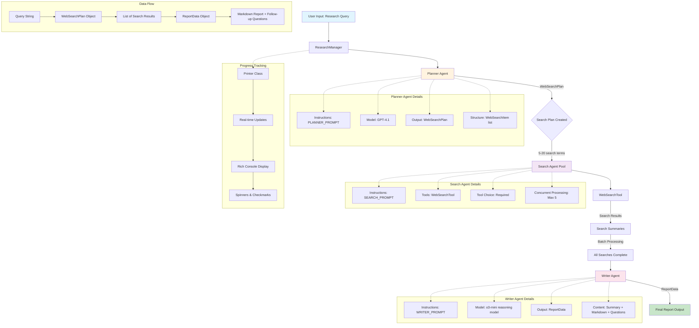

# OpenAI Agents SDK - Agent Interaction Flow

## Agent Interaction Summary

### Flow Steps:
1. **User Query** → ResearchManager receives the research topic
2. **Planning Phase** → Planner Agent breaks down query into 5-20 search terms
3. **Research Phase** → Search Agent performs concurrent web searches (max 5 at a time)
4. **Synthesis Phase** → Writer Agent creates comprehensive report with follow-up questions

### Key Features:
- **Structured Output**: Each agent uses Pydantic models for predictable data flow
- **Concurrent Processing**: Search operations run in parallel for efficiency  
- **Progress Tracking**: Real-time updates via Printer class with Rich console
- **Error Handling**: Graceful failure handling in search operations
- **Tracing**: Built-in OpenAI tracing for observability

### Agent Specialization:
- **Planner**: Strategic query decomposition
- **Search**: Information gathering with web tools
- **Writer**: Synthesis using reasoning model (o3-mini)